# Dashboard User Guide

A step-by-step walkthrough of the Cohort Tracker dashboard, showing how to select classes, filter by night, explore analytics, and interpret the results.

## Prerequisites

- Dashboard server running (`make serve` or `cargo run -- serve`)
- At least one class synced with student data
- Browser open to <http://localhost:3000>

## Step 1: Select a Class

When you first load the dashboard, you'll see the class selection screen with cards for each tracked class.

**What you see:**

- **Class cards** showing class name (masked as "Class 1", "Class 2" in demo mode)
- **Friendly ID** - Internal identifier
- **Status** - Active or Inactive
- **Last synced** - When data was last updated
- **Sync/Activate buttons** - Manage class tracking
- **Demo Mode toggle** - Anonymize all names (enabled by default)
- **Show inactive classes** - View archived cohorts

**Action:** Click on a class card to view its dashboard.

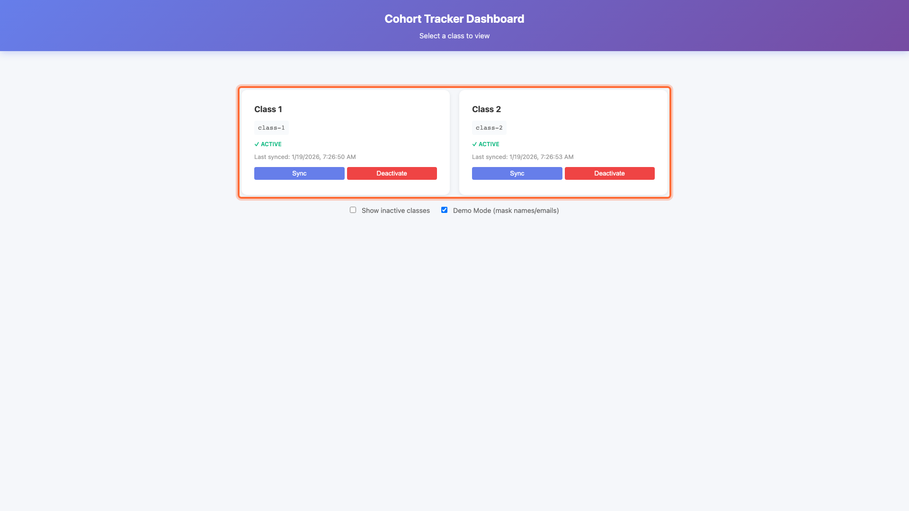

## Step 2: View the Dashboard Overview

After selecting a class, the full dashboard loads with all analytics.

**Header elements:**

- **Back to Classes button** - Return to class selection
- **Class name** - Currently selected cohort (masked as "Class 1" in demo mode)
- **Demo Mode toggle** - Mask student names/emails and class/assignment names
- **Night filter** - Filter by cohort night (if configured)
- **Last sync info** - Shows when data was last updated

**Summary cards:**

- **Students** - Total number of students in the class
- **Assignments** - Total number of assignments in the course
- **Progressions** - Total assignment completions across all students
- **Completion Rate** - Average percentage of assignments completed
- **Avg Grade** - Average score across all completed assignments

**What to look for:**

- Overall completion rate >70% indicates healthy cohort
- Low completion rate (<50%) needs immediate attention
- Grade trends (>80% is strong, <70% indicates struggles)
- Quick snapshot of cohort health before diving into details

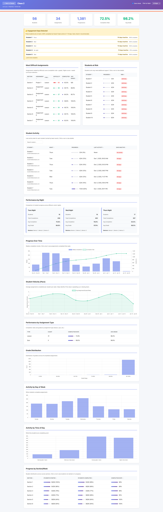

## Step 3: Filter by Night (Optional)

If you've configured student nights via `cargo run -- import --nights`, you can filter by specific cohort nights.

**Why filter by night:**

- Compare mentor effectiveness across different nights
- Identify if certain nights have more struggling students
- Prepare for specific office hours sessions
- Analyze night-specific patterns

**Action:** Select a night from the dropdown in the header to filter all data to that subgroup.

**What changes:**

- All metrics update to show only students from that night
- Summary cards reflect night-specific stats
- Analytics filter to that cohort subset

**If no night data is configured:**

The dashboard will show a message with instructions to import night data using the CLI command.

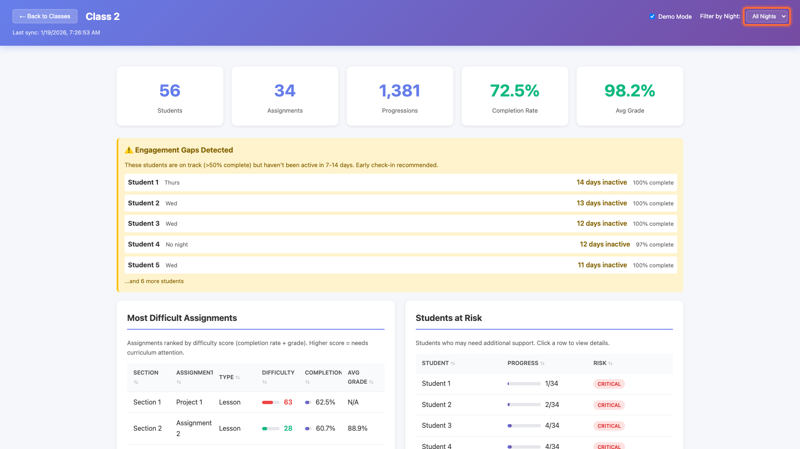

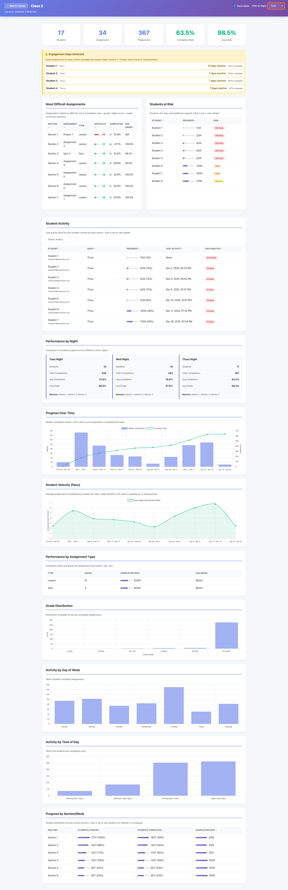

## Step 4: Explore Analytics

### Assignment Type Breakdown

**Shows:** Performance comparison between Lessons and Quizzes

**How to interpret:**

- **Completion Rate**: What percentage of each type students finish
- **Average Grade**: How well students perform on completed work
- **Count**: Total number of each assignment type

**Red flags:**

- Quiz completion significantly lower than lessons → students avoiding assessments
- Quiz grades much lower than lessons → knowledge gap between learning and application
- Very low completion on either type → curriculum difficulty or engagement issues

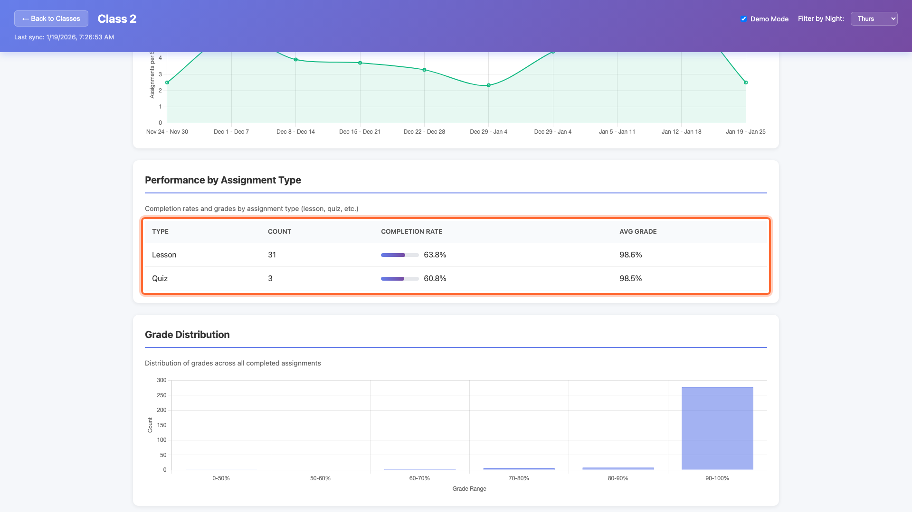

### Grade Distribution

**Shows:** Histogram of grade ranges (0-59%, 60-69%, 70-79%, 80-89%, 90-100%)

**How to interpret:**

- **Healthy distribution**: Bell curve centered around 80-90%
- **Left-skewed**: Many students struggling (high count in 0-59%)
- **Right-skewed**: Most students excelling (high count in 90-100%)

**Red flags:**

- Bimodal distribution (two peaks) → cohort split between high/low performers
- Heavy concentration below 70% → curriculum too difficult or students need more support

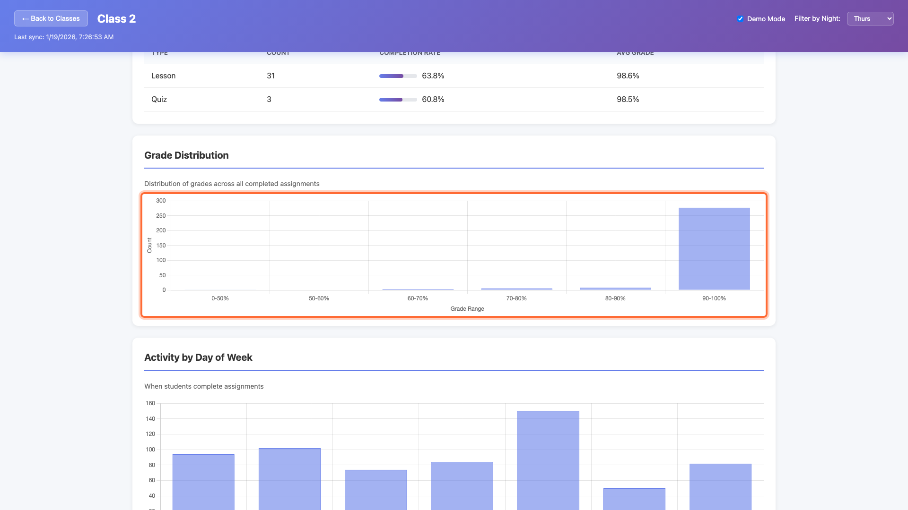

### Velocity Tracking

**Shows:** Average assignments completed per week over time

**How to interpret:**

- **Trend line**: Is velocity increasing (students gaining momentum) or decreasing (burnout)?
- **Absolute value**: Are students completing enough work to finish on time?
- **Consistency**: Steady pace vs. sporadic bursts

**Red flags:**

- Declining velocity → students losing motivation or hitting difficulty wall
- Very low velocity (< 2-3 assignments/week) → risk of not completing program
- Sudden drops → investigate what happened that week (holiday? difficult section?)

### Students at Risk

**Shows:** Students with low completion rates or poor grades

**Columns:**

- **Name**: Student identifier
- **Completion**: Percentage of assignments completed
- **Avg Grade**: Average score on completed work
- **Days Inactive**: Days since last activity
- **Risk Level**: High/Medium/Low based on multiple factors

**How to interpret:**

- **High risk**: Immediate intervention needed
- **Medium risk**: Monitor closely, reach out proactively
- **Low risk**: Doing okay but could use encouragement

**Action items:**

- Sort by "Days Inactive" to find students who've gone silent
- Sort by "Completion" to find students falling behind
- Sort by "Avg Grade" to find students struggling with content

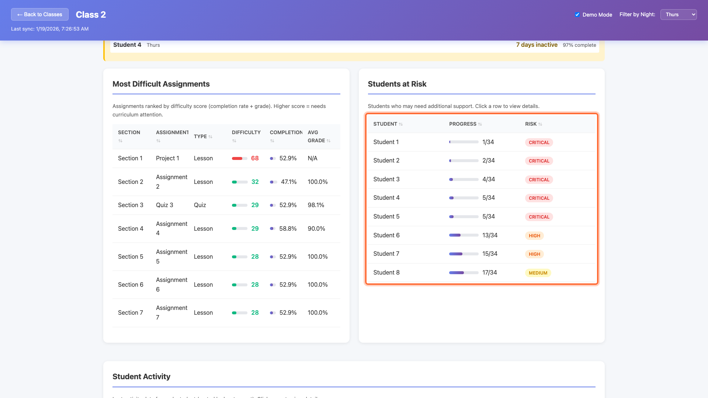

### Engagement Gaps

**Shows:** Students who are 7-14 days inactive but still >50% complete

**Why this matters:**

- These students were engaged but recently went silent
- Early intervention window before they become "at risk"
- Often just need a check-in or encouragement

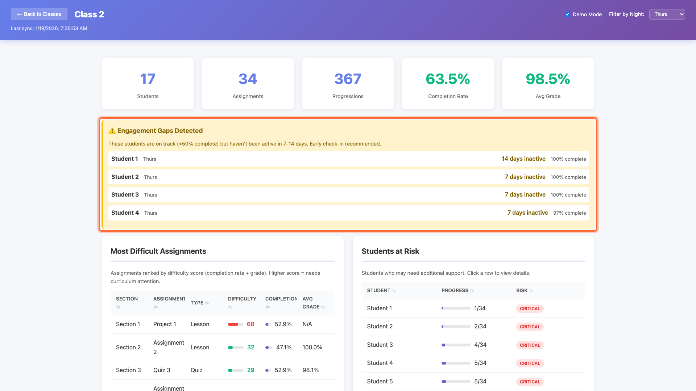

**How to investigate:**

Click on any student in the engagement gaps list to see their detailed progress:

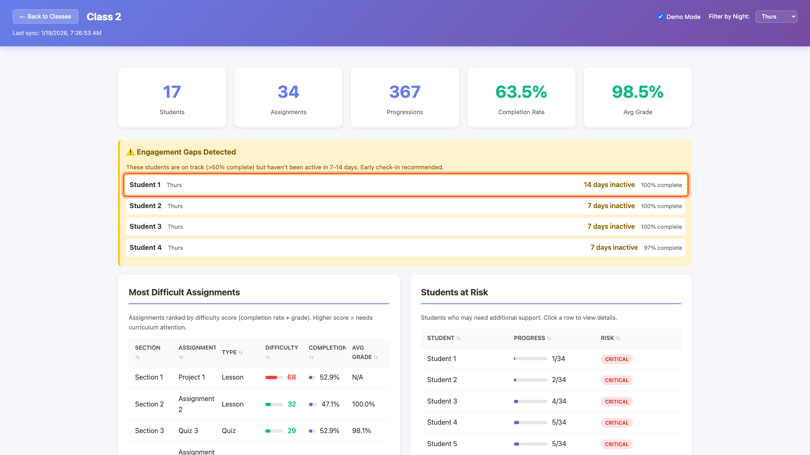

This opens their full student modal with activity patterns and progress charts:

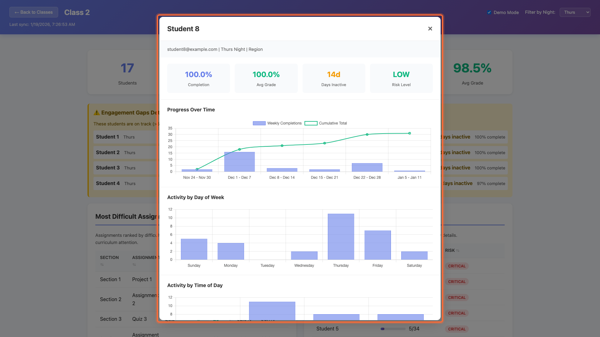

**What to look for:**

- **Days Inactive**: How long since last activity
- **Completion %**: Shows they were making progress
- **Activity patterns**: When they typically work (day/time charts)
- **Last assignment**: What they were working on when they stopped

**Action items:**

- Reach out personally to re-engage
- Ask if they're stuck on the last assignment
- Offer office hours support at their typical work times

### Assignment Difficulty Ranking

**Shows:** Which assignments are hardest for students (composite score)

**Columns:**

- **Section**: Course section/week
- **Assignment**: Name of the assignment
- **Type**: Lesson, Quiz, etc.
- **Completion Rate**: What % of students who started it finished it
- **Avg Grade**: Average score for those who completed it
- **Difficulty Score**: Weighted combination (60% completion, 40% grade)

**How to interpret:**

- **High difficulty score (>0.5)**: Major blocker assignment
- **Low completion, high grade**: Assignment is intimidating but doable
- **High completion, low grade**: Assignment is confusing or poorly designed

**Action items:**

- Prepare extra support materials for high-difficulty assignments
- Mention these assignments proactively in office hours
- Consider curriculum improvements for persistent blockers

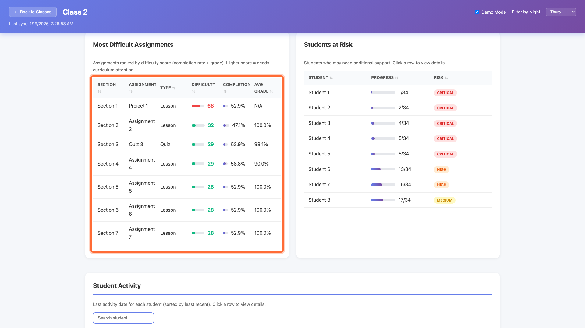

### Student Activity

**Shows:** Complete list of all students with their last activity date

**Features:**

- **Search box**: Filter students by name
- **Sortable columns**: Click headers to sort
- **Click rows**: Open student detail modal

**Columns:**

- **Student**: Name (masked in demo mode)
- **Night**: Cohort night assignment
- **Progress**: Completion percentage
- **Last Activity**: Date of most recent work
- **Days Inactive**: Days since last activity

**Use cases:**

- Find students who haven't been active recently
- Search for specific students quickly
- Monitor overall class engagement
- Identify patterns in activity timing

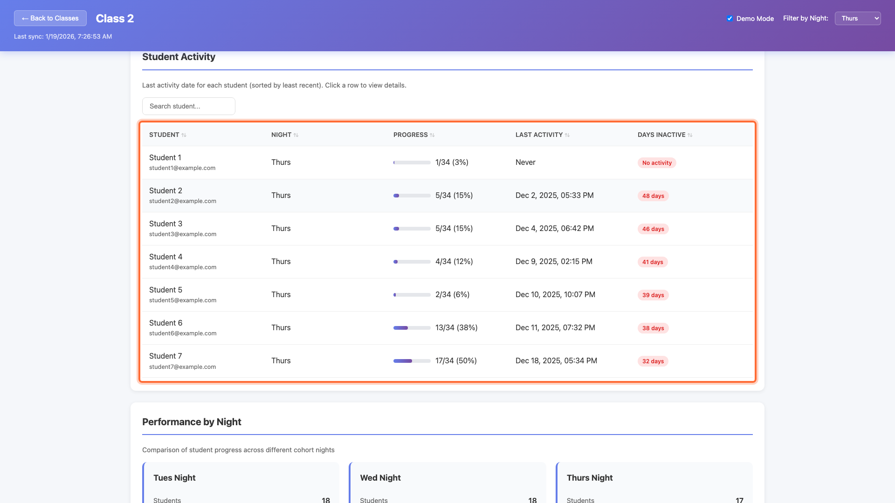

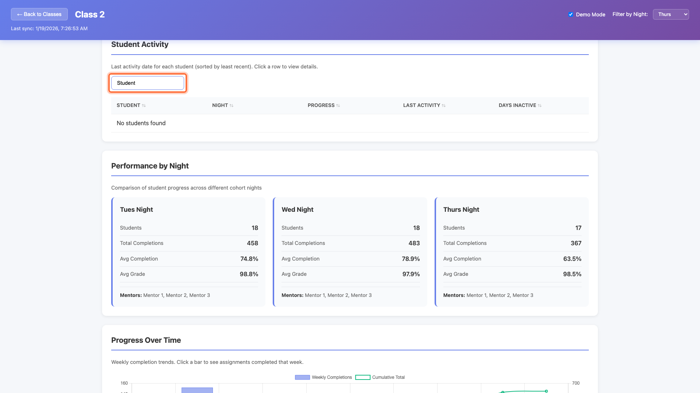

### Performance by Night

**Shows:** Side-by-side comparison of different cohort nights

**Metrics per night:**

- Total students
- Average completion rate
- Average grade
- Mentor name (if configured)

**How to use:**

- Compare mentor effectiveness
- Identify if certain nights need more support
- Balance workload across nights
- Recognize high-performing mentor strategies

**Action items:**

- Share best practices from high-performing nights
- Provide additional support to struggling nights
- Consider mentor pairing or shadowing

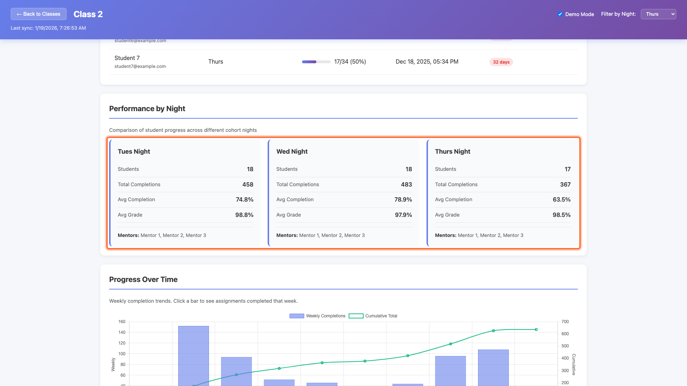

### Progress Over Time

**Shows:** Bar chart of weekly assignment completions

**Features:**

- **Interactive**: Click any bar to see which assignments were completed that week
- **Trend analysis**: Visual representation of cohort momentum
- **Week-by-week breakdown**: Identify slow/fast periods

**How to interpret:**

- **Increasing bars**: Cohort gaining momentum
- **Decreasing bars**: Slowdown (investigate cause)
- **Gaps/dips**: Holidays, difficult sections, or engagement issues

**Action items:**

- Celebrate high-completion weeks with the cohort
- Investigate low-completion weeks for blockers
- Use historical data to predict future pacing

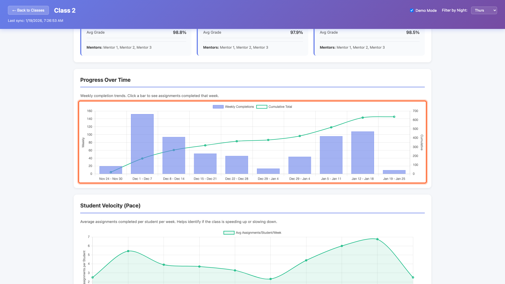

### Activity Patterns

**Activity by Day of Week:**

Shows which days students complete the most work. Helps you:

- Schedule office hours on high-activity days
- Understand student work patterns
- Identify if weekend vs. weekday engagement differs

**Activity by Time of Day:**

Shows what hours students are working. Helps you:

- Schedule office hours at optimal times
- Understand if students work during class time or independently
- Identify night owls vs. early birds

**Use cases:**

- Optimize office hours scheduling
- Understand student lifestyle patterns
- Tailor communication timing (send reminders when students are active)

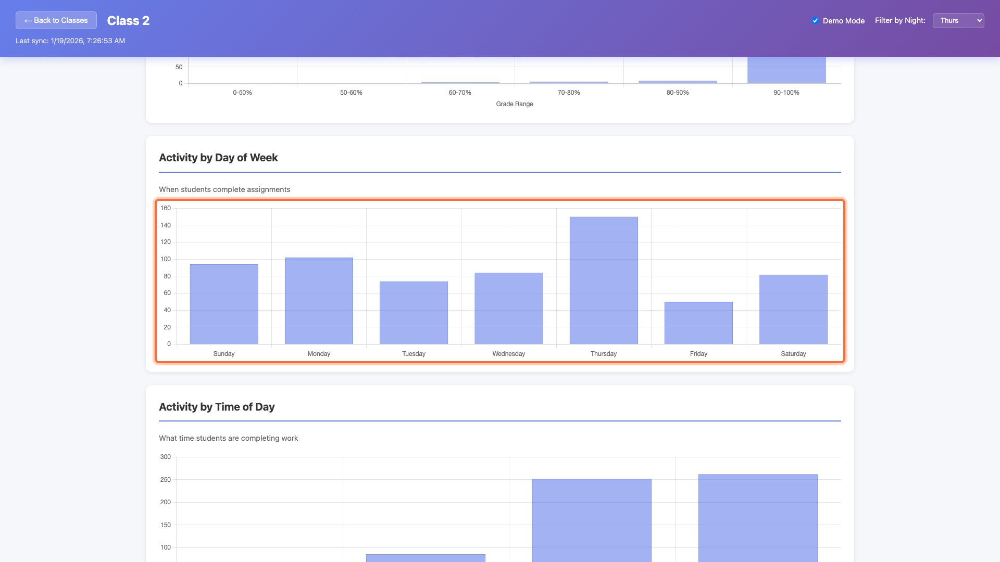

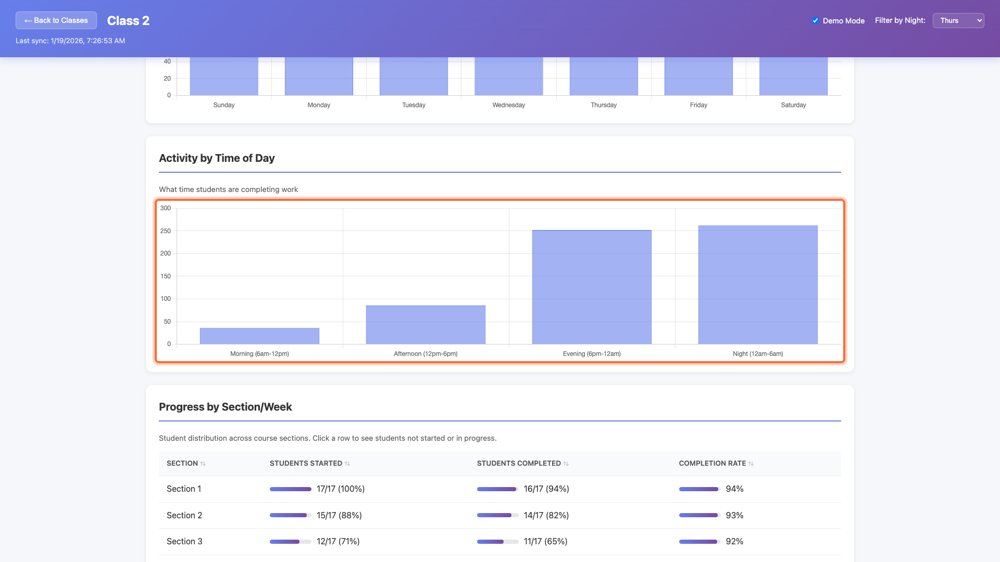

### Progress by Section/Week

**Shows:** How students are distributed across course sections

**Features:**

- **Click rows**: See which students haven't started or are in progress on that section
- **Completion tracking**: Monitor section-by-section progress
- **Bottleneck identification**: Find sections where students get stuck

**Columns:**

- **Section**: Course section/week name
- **Students Started**: How many began this section
- **Students Completed**: How many finished this section
- **Completion Rate**: Percentage who finished

**How to interpret:**

- **Low completion rate**: Section is a bottleneck
- **Many in progress**: Students currently working through it
- **None started**: Future content

**Action items:**

- Prepare support for sections with low completion
- Click rows to see exactly who needs help
- Proactively reach out to students stuck on difficult sections

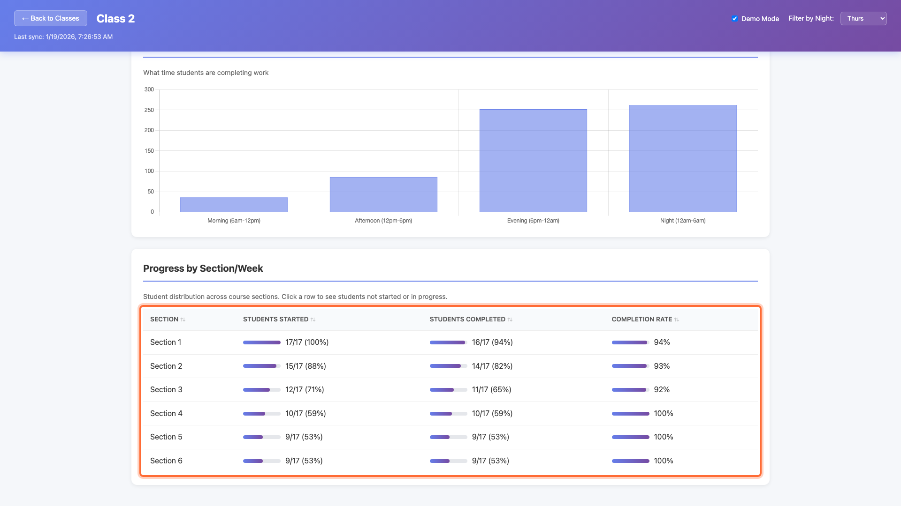

## Step 5: Interact with Tables

All tables support **click-to-sort** functionality.

**How to use:**

1. Click any column header to sort by that column
2. Click again to reverse sort order (ascending ↔ descending)
3. Visual indicator shows current sort column

**Common sorting strategies:**

**Students at Risk table:**

- Sort by "Days Inactive" → Find students who've gone silent
- Sort by "Completion" → Find students furthest behind
- Sort by "Risk Level" → Prioritize intervention efforts

**Assignment Difficulty table:**

- Sort by "Difficulty Score" → Focus on biggest blockers first
- Sort by "Completion Rate" → Find assignments students avoid
- Sort by "Avg Grade" → Find assignments students fail

**Engagement Gaps table:**

- Sort by "Days Inactive" → Prioritize longest-silent students
- Sort by "Completion" → Focus on students who were doing well

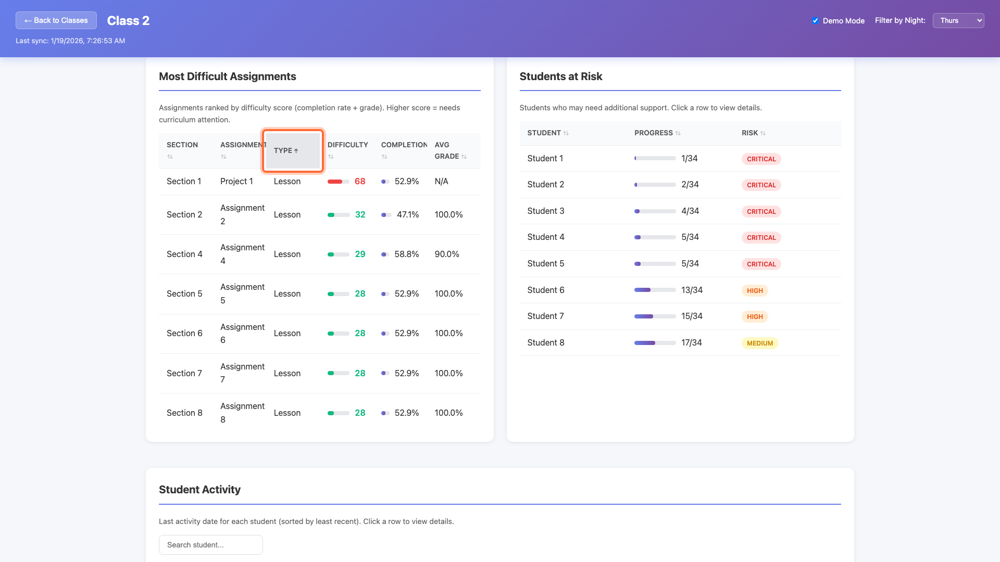

### View Detailed Information

Click on any **student row** to see their full progress details:

**Student modal includes:**

- Overall stats (completion %, average grade, activity)
- Progress over time chart
- Activity by day of week
- Activity by time of day
- Full assignment list with grades

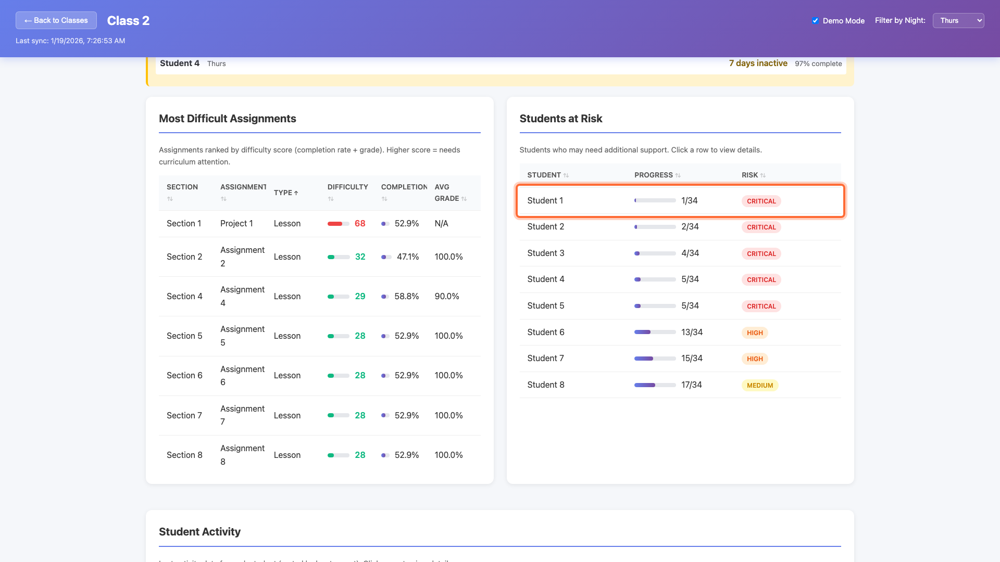

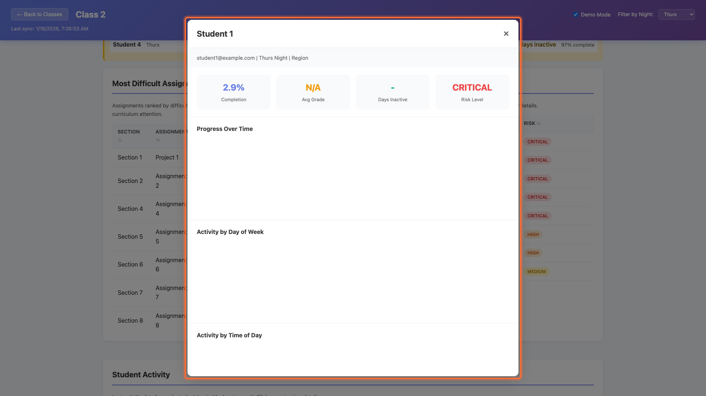

Click on any **assignment row** to see which students are struggling with it:

**Assignment modal includes:**

- Completion and grade statistics
- List of students who completed it
- List of students who haven't started or are stuck
- Individual student grades

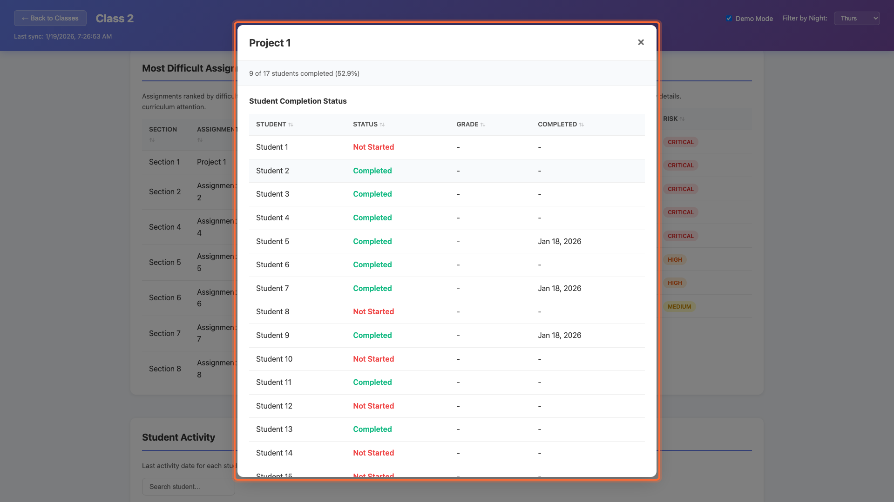

**Tip:** You can close any modal by:
- Clicking the X button in the top-right corner
- Clicking outside the modal (on the darkened background)
- Pressing the Escape key

## Step 6: Interpret the Results

### Healthy Cohort Indicators

- Overall completion rate >70%
- Average grade >80%
- Velocity steady or increasing
- Few students at high risk
- Grade distribution centered around 80-90%

### Warning Signs

- Completion rate <50%
- Many students >14 days inactive
- Declining velocity trend
- Bimodal grade distribution
- High difficulty scores on multiple assignments

### Action Plan Based on Data

**If completion rates are low:**

1. Check Assignment Difficulty table for blockers
2. Prepare targeted support for those assignments
3. Reach out to at-risk students individually

**If grades are low:**

1. Review Grade Distribution for patterns
2. Check if specific assignment types (lessons vs quizzes) are problematic
3. Consider if curriculum needs adjustment

**If velocity is declining:**

1. Check Engagement Gaps for students going silent
2. Send motivational check-ins to the cohort
3. Investigate if a specific section is causing slowdown

**If many students are inactive:**

1. Sort Students at Risk by "Days Inactive"
2. Prioritize students who were previously engaged (check Engagement Gaps)
3. Reach out with personalized messages

## Tips and Best Practices

### Daily Workflow

1. Run `cargo run -- sync` to fetch latest data
2. Start dashboard with `make serve`
3. Check summary cards for overall health
4. Review Students at Risk table
5. Check Engagement Gaps for early intervention opportunities

### Weekly Review

1. Compare velocity week-over-week
2. Review Assignment Difficulty for curriculum improvements
3. Analyze Grade Distribution trends
4. Use Night Filter to compare mentor effectiveness

### Before Office Hours

1. Filter by your night
2. Review Students at Risk for your cohort
3. Check Assignment Difficulty to prepare support materials
4. Note students in Engagement Gaps to reach out to

### Demo Mode

Toggle "Demo Mode" in the header to anonymize student names for:

- Screenshots for documentation
- Sharing metrics with stakeholders
- Presentations without exposing PII

## Troubleshooting

**No data showing:**

- Ensure you've run `cargo run -- sync` recently
- Check that the selected class has students
- Verify database exists at `~/.cohort-tracker.db`

**Metrics seem wrong:**

- Try a full sync: `cargo run -- sync --full`
- Check that night filtering is set correctly
- Verify class selection (not "All Classes" if you want specific data)

**Tables not sorting:**

- Ensure JavaScript is enabled
- Check browser console for errors
- Refresh the page

## Next Steps

- [Database Schema](database.md) - Query the SQLite database directly
- [Development Guide](development.md) - Customize the dashboard
- [Analytics Features](analytics-features.md) - Technical details on calculations
